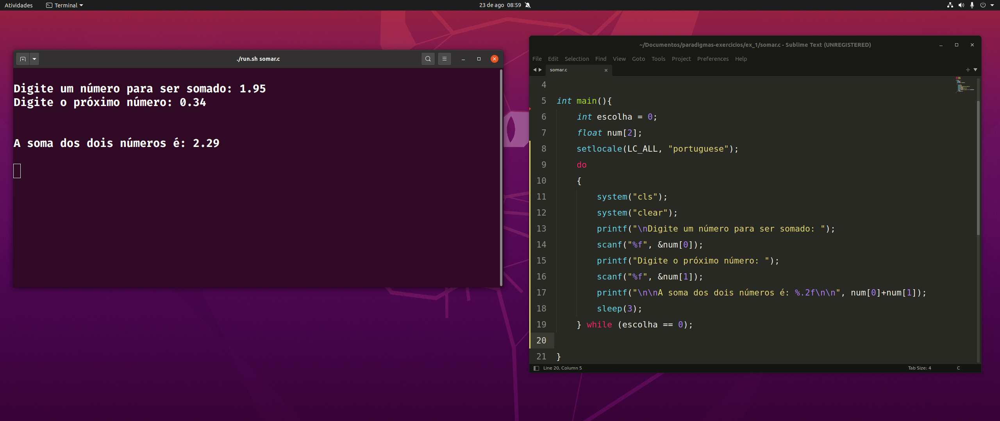
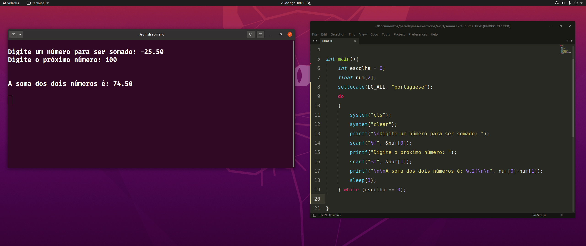

# Exercício 1 de paradigmas de programação 

Escrever um programa que resolva a soma entre dois números inseridos pelo usuário
- usuário deve digitar dois números 
- programa deve retornar a soma entre eles 

## Abaixo os prints com alguns testes do programa 

