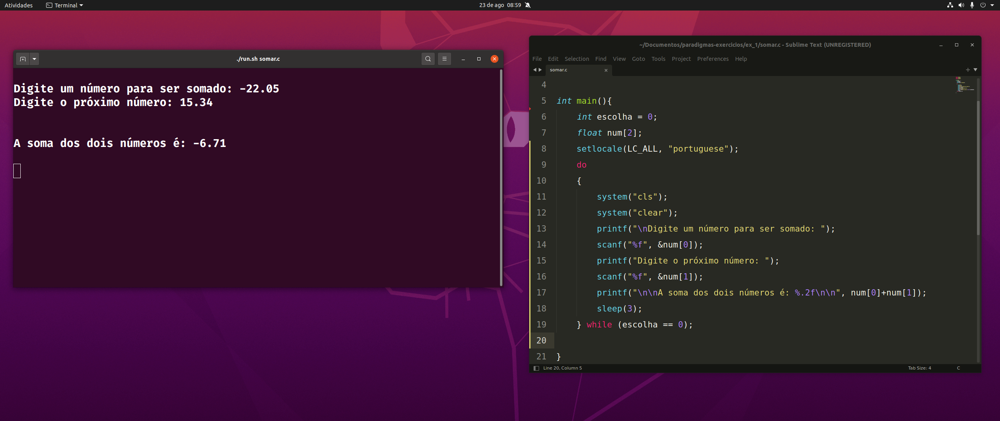
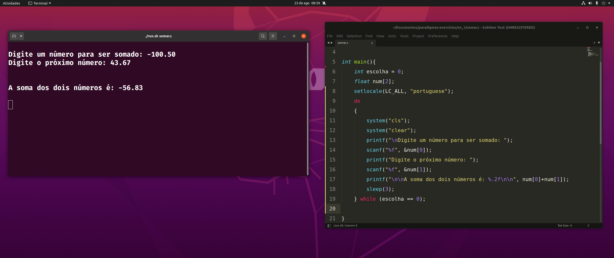

# Programming Paradigms Exercise 1

Write a program that calculates the sum of two numbers entered by the user.  
- The user must input two numbers.  
- The program should return the sum of these numbers.  

## Below are screenshots of some test runs of the program  

